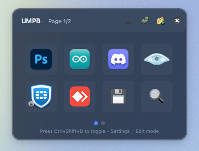

# UMPB – Universal Mini Palette Board

A frameless, always‑on‑top overlay (Python + PySide6) that acts like a virtual Stream Deck. Toggle it globally, add shortcuts or apps on the fly, and keep your layout between sessions.



---
## Features
- Two‑row grid (4×2) per page, up to 10 pages
- Global hot‑keys:
  - <kbd>⌘/Ctrl + Shift + D</kbd> – show/hide overlay
  - <kbd>⌥ + 1‑8</kbd>           – trigger tile 1‑8
- Drag window, edit mode with delete / add (+) buttons
- Persist layout to `~/.umpb_layout.json`
- Icons for bundled apps automatically loaded

---
## Quick start
```bash
python -m venv .venv
source .venv/bin/activate
pip install -r requirements.txt
python deck_overlay.py
```

On macOS grant System Settings → Privacy & Security → Accessibility for your Terminal/Python, so global hot‑keys work.

## Packaging / distribution

macOS: ```pyinstaller --windowed --icon icon.icns deck_overlay.py```

Windows: ```pyinstaller --noconsole --icon icon.ico deck_overlay.py```

Icons can be generated from icon1024.png (1024×1024) using iconutil (mac) or an ICO converter (win).
