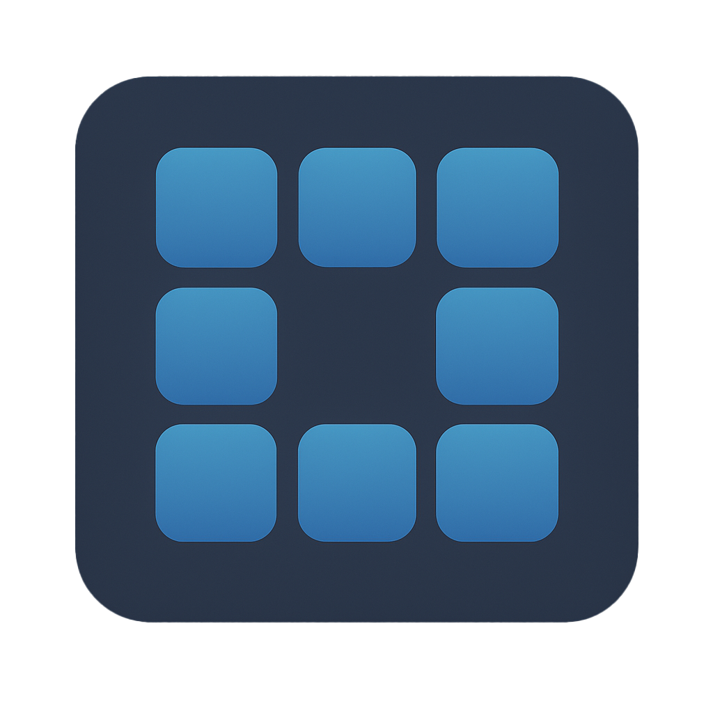

<div id="top"></div>

<!-- PROJECT SHIELDS -->
[![Contributors][contributors-shield]][contributors-url]
[![Forks][forks-shield]][forks-url]
[![Stargazers][stars-shield]][stars-url]
[![Issues][issues-shield]][issues-url]
[![MIT License][license-shield]][license-url]
[![LinkedIn][linkedin-shield]][linkedin-url]

<!-- PROJECT LOGO -->
<div align="center">
  <a href="https://github.com/zEhmsy/umpb/blob/main/icon1024.png">
    
  </a>

<h3 align="center">UMPB</h3>

  <p align="center">
    A frameless, always‑on‑top overlay (Python + PySide6) that acts like a virtual Stream Deck. Toggle it globally, add shortcuts or apps on the fly, and keep your layout between sessions.
    <br />
    <a href="https://github.com/zEhmsy/umpb"><strong>Explore the docs »</strong></a>
    <br />
    <br />
    <a href="https://github.com/zEhmsy/umpb">View Demo</a>
    ·
    <a href="https://github.com/zEhmsy/umpb/issues">Report Bug</a>
    ·
    <a href="https://github.com/zEhmsy/umpb/issues">Request Feature</a>
  </p>
</div>


<!-- TABLE OF CONTENTS -->
<details>
  <summary>Table of Contents</summary>
  <ol>
    <li>
      <a href="#about-the-project">About The Project</a>
      <ul>
        <li><a href="#built-with">Built With</a></li>
      </ul>
    </li>
    <li>
      <a href="#getting-started">Getting Started</a>
      <ul>
        <li><a href="#prerequisites">Prerequisites</a></li>
        <li><a href="#installation">Installation</a></li>
      </ul>
    </li>
    <li><a href="#usage">Usage</a></li>
    <li>
      <a href="#detailed-function-explanation">Detailed Function Explanation</a>
      <ul>
        <li><a href="#send_keystroke">send_keystroke</a></li>
        <li><a href="#prompt_new_shortcut">_prompt_new_shortcut</a></li>
        <li><a href="#load_and_save_layout">_load_layout / _save_layout</a></li>
      </ul>
    </li>
    <li><a href="#roadmap">Roadmap</a></li>
    <li><a href="#contributing">Contributing</a></li>
    <li><a href="#license">License</a></li>
    <li><a href="#contact">Contact</a></li>
    <li><a href="#acknowledgments">Acknowledgments</a></li>
  </ol>
</details>

---

## About The Project

**UMPB (Universal Mini Palette Board)** is an always-on overlay that replicates the functions of a software Stream Deck: customizable keystroke pages, keyboard or app launch actions, global hot-key toggle, and automatic layout persistence.

### Screenshot


### Built With
* [PySide6](https://pypi.org/project/PySide6/) – GUI Qt for Python 6
* [pynput](https://pypi.org/project/pynput/) – global keyboard listener

---
## Getting Started

### Prerequisites
* Python ≥ 3.10
* macOS, Windows o Linux (X11/Wayland)

### Installation
```bash
# clone & set‑up venv
git clone https://github.com/USERNAME/umpb.git
cd umpb
python -m venv .venv
source .venv/bin/activate
pip install -r requirements.txt
python deck_overlay.py
```
<p align="right">(<a href="#top">back to top</a>)</p>

---
## Usage

Toggle overlay: ```⌘/Ctrl + ⇧ + D```

Trigger tile 1‑8: ```⌥ + 1‑8```

Edit‑mode: click on the header icon

Layout saved in ```~/.umpb_layout.json``` and reload at the start.

### Detailed Function Explanation

`send_keystroke(combo: str)`

Cross-platform send combination ("`ctrl+c`", "`cmd+v`" ...) using pynput. On macOS it automatically converts ctrl to cmd if needed.

`_prompt_new_shortcut()`

Opens a dialog asking whether to create an App link (file picker) or Key combination (QKeySequenceEdit widget). Validates input, instantiates Shortcut, refreshes page and saves layout.

`_load_layout() / _save_layout()`

Serialize the pages array into JSON under `~/.umpb_layout.json`. Call on every change and in closeEvent for immediate persistence.

<p align="right">(<a href="#top">back to top</a>)</p>

<!-- CONTRIBUTING -->

## Contributing

Contributions are what make the open source community such an amazing place to learn, inspire, and create. Any contributions you make are **greatly appreciated**.

If you have a suggestion that would make this better, please fork the repo and create a pull request. You can also simply open an issue with the tag "enhancement".
Don't forget to give the project a star! Thanks again!

1. Fork the Project
2. Create your Feature Branch (`git checkout -b feature/AmazingFeature`)
3. Commit your Changes (`git commit -m 'Add some AmazingFeature'`)
4. Push to the Branch (`git push origin feature/AmazingFeature`)
5. Open a Pull Request

If you want to _*support*_ me or you appraciate the project you can: [](https://www.buymeacoffee.com/gturturro)

<!-- FEEDBACK-->

For now, this project serves as a functional demonstration of digest authentication implementation on Arduino boards with Ethernet connectivity, with potential future iterations to support additional hardware platforms. [If yu like it! Leave a star ⭐️](https://github.com/zEhmsy/umpb/stargazers)

<p align="right">(<a href="#top">back to top</a>)</p>

<!-- LICENSE -->

## License

Distributed under the MIT License. See `LICENSE.txt` for more information.

<p align="right">(<a href="#top">back to top</a>)</p>

<!-- CONTACT -->

## Contact

Giuseppe Tururro - [WHOAMI?](https://zehmsy.github.io/digital-cv/) - info.g.turturro@gmail.com

Project Link: [https://github.com/zEhmsy/umpb](https://github.com/zEhmsy/umpb)

<p align="right">(<a href="#top">back to top</a>)</p>

<!-- ACKNOWLEDGMENTS -->

## Acknowledgments

* [Python](https://python.org)

<p align="right">(<a href="#top">back to top</a>)</p>

[contributors-shield]: https://img.shields.io/github/contributors/zEhmsy/umpb.svg?style=for-the-badge
[contributors-url]: https://github.com/zEhmsy/umpb/graphs/contributors
[forks-shield]: https://img.shields.io/github/forks/zEhmsy/umpb.svg?style=for-the-badge
[forks-url]: https://github.com/zEhmsy/umpb/network/members
[stars-shield]: https://img.shields.io/github/stars/zEhmsy/umpb.svg?style=for-the-badge
[stars-url]: https://github.com/zEhmsy/umpb/stargazers
[issues-shield]: https://img.shields.io/github/issues/zEhmsy/umpb.svg?style=for-the-badge
[issues-url]: https://github.com/zEhmsy/umpb/issues
[license-shield]: https://img.shields.io/github/license/zEhmsy/umpb.svg?style=for-the-badge
[license-url]: https://github.com/zEhmsy/umpb/blob/master/LICENSE.txt
[linkedin-shield]: https://img.shields.io/badge/-LinkedIn-black.svg?style=for-the-badge&logo=linkedin&colorB=555
[linkedin-url]: https://linkedin.com/in/g-turturro
[product-screenshot]: product_screenshot.PNG
